<h2 align="center">Realtime Application with NestJS</h2>
  
<h3 align="center">Build a chatting App using Socket.io and NestJs</h3>

This project is inspired by Mr.DenzelCode's repository  [Nest-Auth](https://github.com/DenzelCode/nest-auth)

It's my attempt to embrace best practices of using MongoDB, and trying to write maintainabe code, based on my experience acquired by building several NestJs projects previously.
It might not be that fancy, but I hope you can learn something new from this project too, just like I did 😃

## Project highlights:
1. **NestJs** backend framework
2. **MongoDB**
3. **SocketIO** realtime app framework
4. **JWT** authentication
5. **Class-transformer, Class-validator** for validation
6. **Swagger** for API documentation

### APIs
**Auth controller**\
Register, login, logout, refresh token
<p>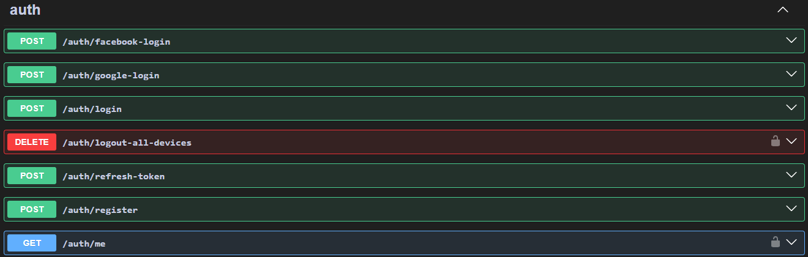</p>

**Code Controller**\
Issue code to verify your email (for account registration or password recovery)
<p>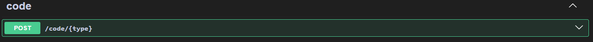</p>

**Request Controller**\
Manage friend request, group request, group invitation
<p>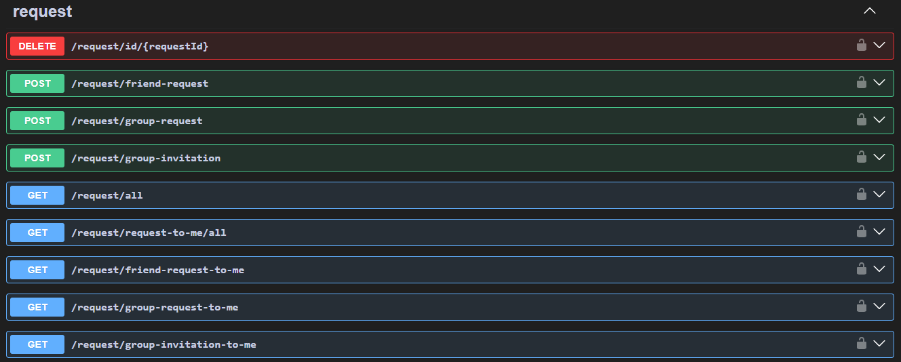</p>

**User Controller**\
Search users
<p>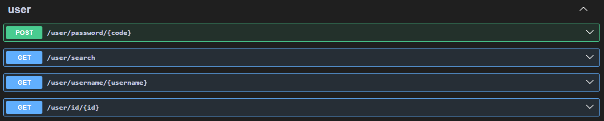</p>

Update profile
<p>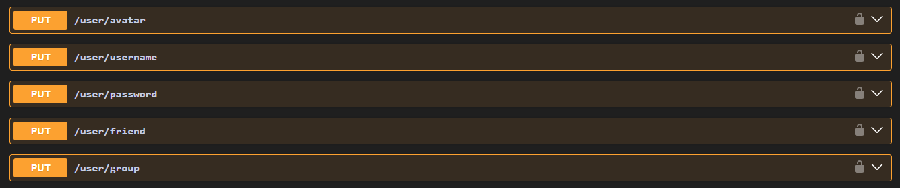</p>

Manage user friends and groups
<p>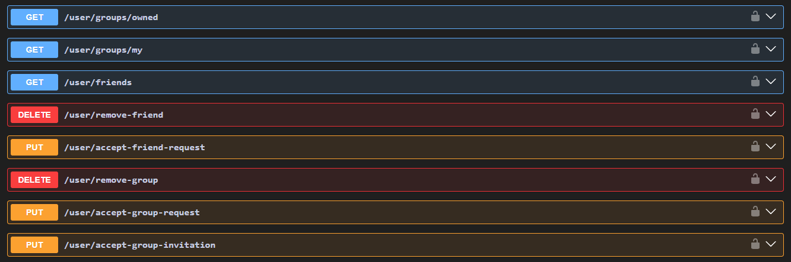</p>

**Group Controller**\
Search groups
<p>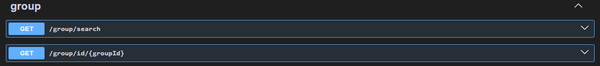</p>

Manage user groups
<p>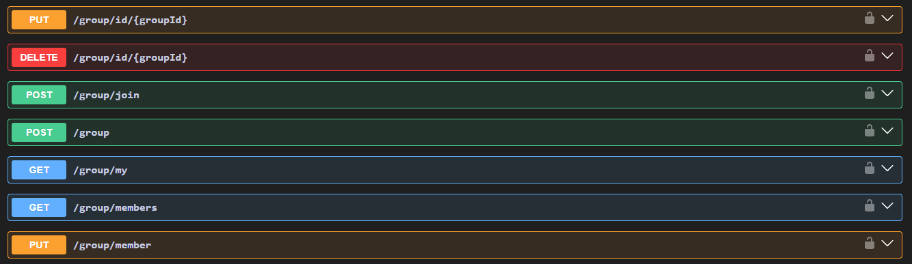</p>

**Message Controller**\
Manage direct and group messages
<p>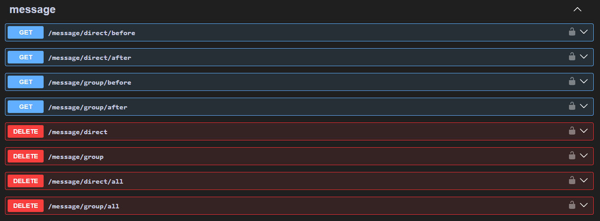</p>

### Gateways

Connect Socket.io server (login with token)
<p>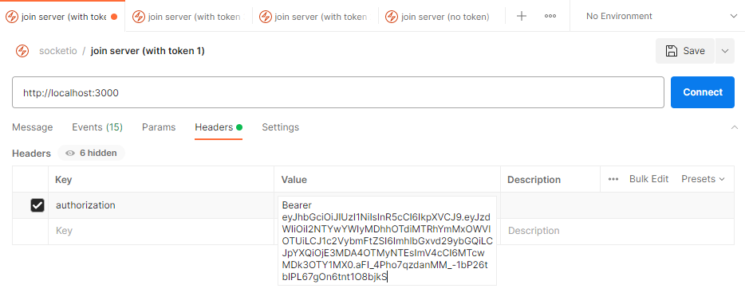</p>

#### User Gateway

**logout**
<p>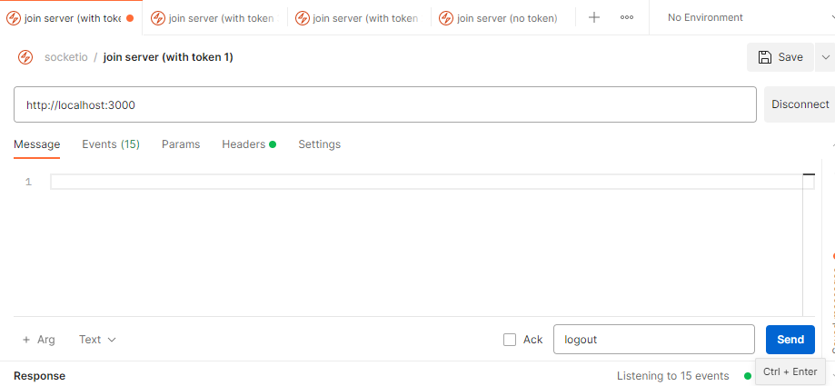</p>

#### Message Gateway

**message:direct** (send direct message)
<p>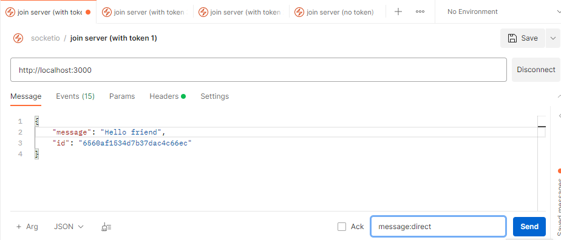</p>

**message:group** (send group message)
<p>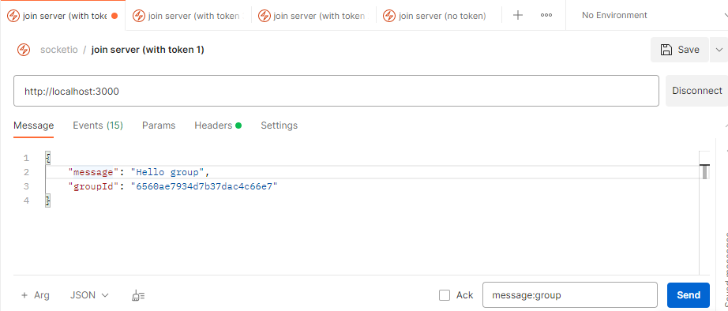</p>

## Manually testing
First, download the source code, then run:
```
npm install
npm run dev
```

To test API, visit http://localhost:3000/api

To test Gateway, use Postman Desktop and this sample collection\
👉 [socketio-server-collection](https://www.postman.com/dark-firefly-114703/workspace/nestjs-server/collection/655d95716d9c2bc849661a32?action=share&creator=31321708)

**Thank you and happy coding!**